# Meta-VQE - different cases

This is the forked repository for the article "The Meta-Variational Quantum Eigensolver (Meta-VQE): Learning energy profiles of parameterized Hamiltonians for quantum simulation", Alba Cervera-Lierta, Jakob S. Kottmann, Alán Aspuru-Guzik, [arXiv:2009.13545[quant-ph]](https://arxiv.org/abs/2009.13545).

We used Meta-VQE algorithm to calculate ground state energies for 4 different systems - three 1D and one 2D. Below we present our results.

__1D system - 7 qubits__

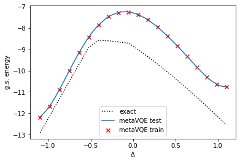
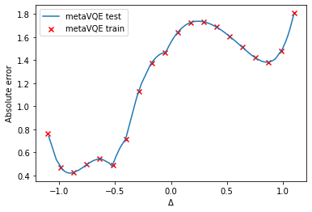
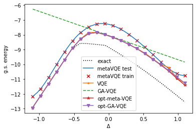
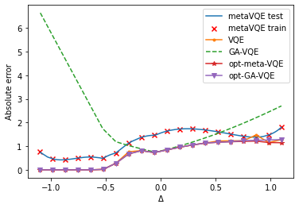

__1D system - 8 qubits__

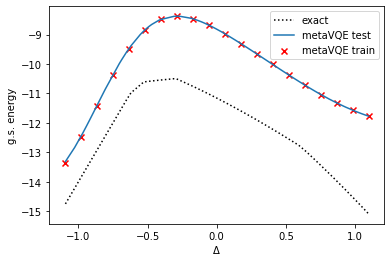
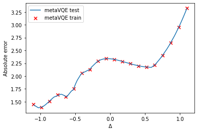
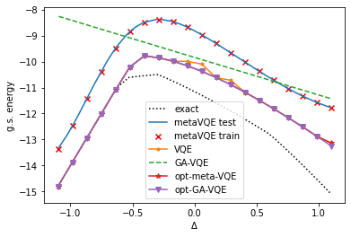
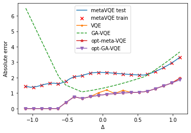

__1D system - 9 qubits__

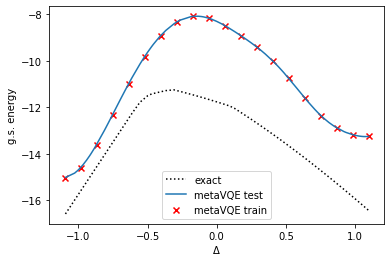
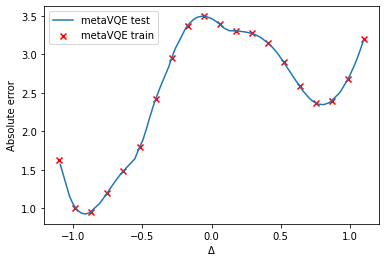
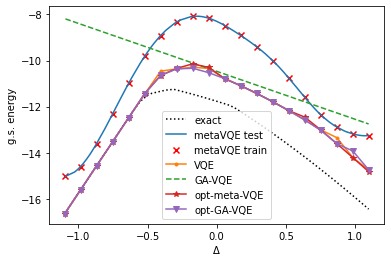
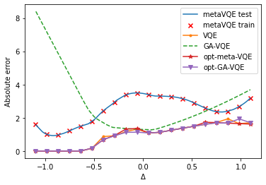

__2D system - 9 qubits__

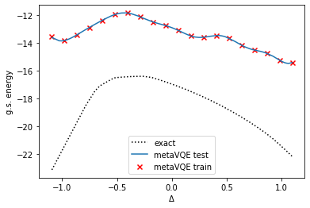
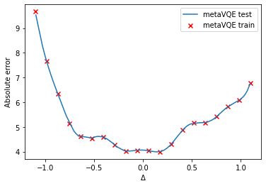
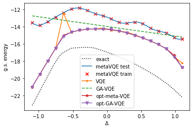

