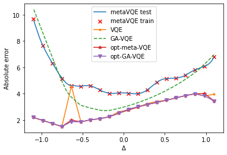

# Meta-VQE - different cases

This is the forked repository for the article "The Meta-Variational Quantum Eigensolver (Meta-VQE): Learning energy profiles of parameterized Hamiltonians for quantum simulation", Alba Cervera-Lierta, Jakob S. Kottmann, Alán Aspuru-Guzik, [arXiv:2009.13545[quant-ph]](https://arxiv.org/abs/2009.13545).

We wanted to analyze the behaviour of the Meta-VQE algorithm with the scaling of the size of the system under study. To do that we calculated the ground state energies, using a range of different methods, for 4 different systems - three 1D chains and one 2D square grid. Below we present our results.

__1D system - 7 qubits__

__1D system - 8 qubits__

__1D system - 9 qubits__

__2D system - 9 qubits__

We can see, that with the increasing size of the 1D lattice the algorithm is loosing precision. This is all the more apparent when we move to the 2D case, where the number of connections between different sites is significantly larger than in a simple chain.
